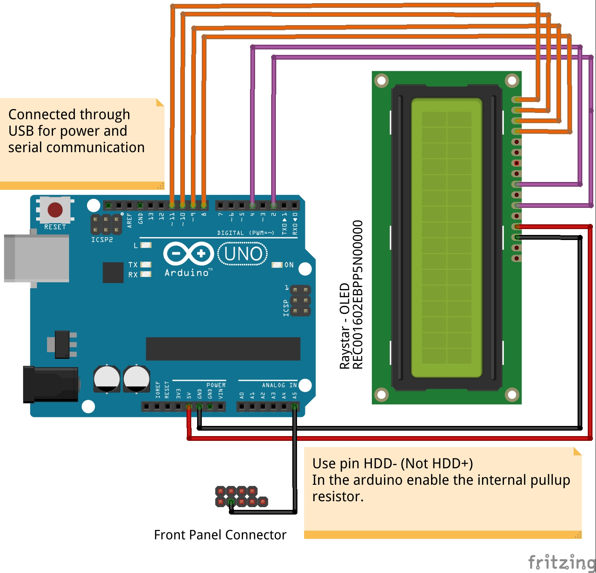
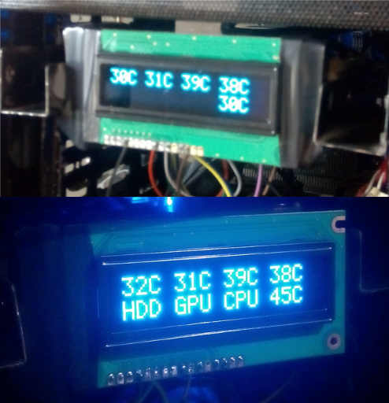

# arduinoSystemMonitor
Code for running an arduino connected to a 16x2 display and to a Linux PC using serial communication to show system information

##Information Displayed
CPU cores temperatures

GPU temperature

CPU GPU HDD activity

HDD activity is monitored through the MB front panel connector

CPU activity is measured by clock frequency (average of all cores)

GPU activity is measured by the power state of the gpu

#Diagram

#Result

